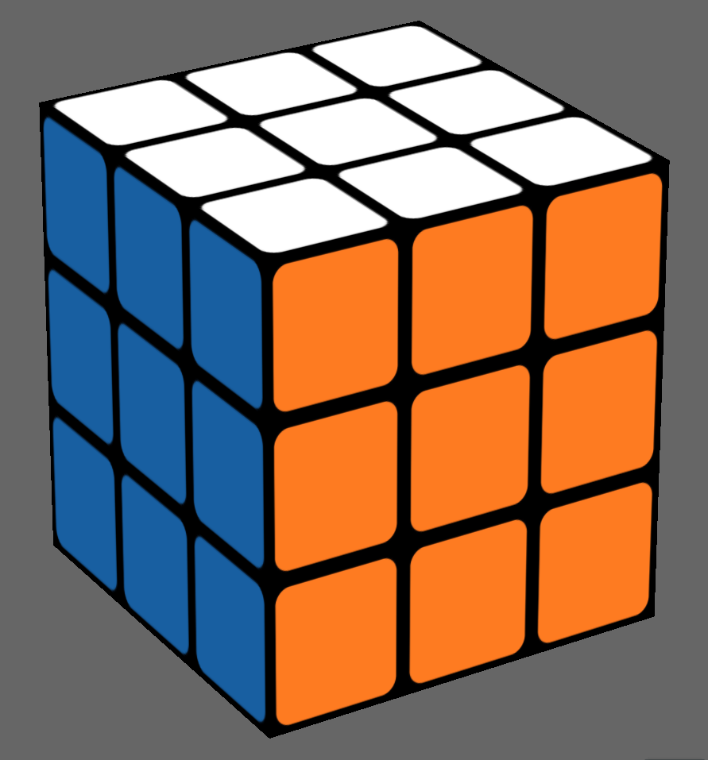
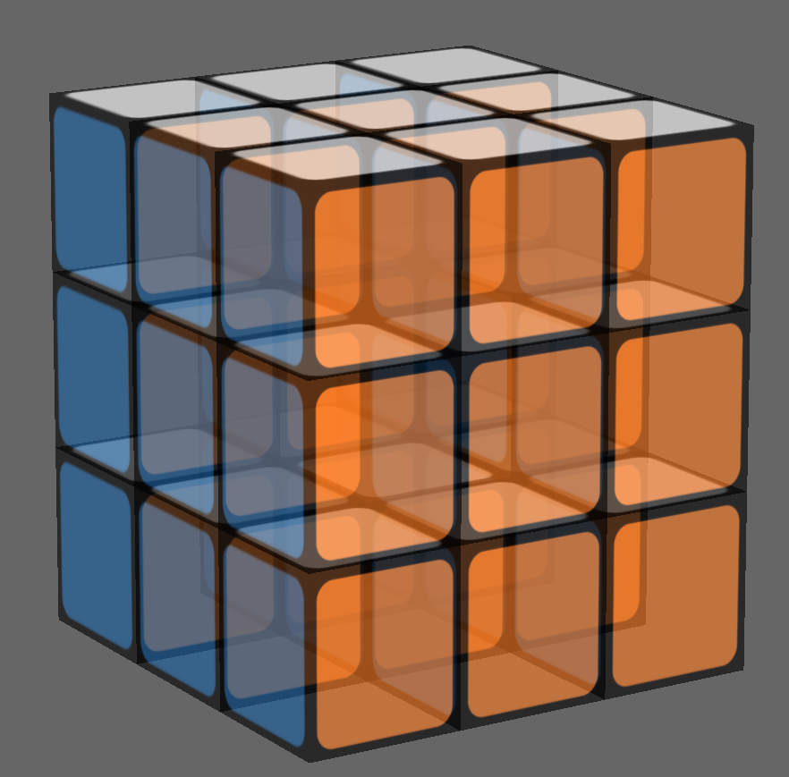
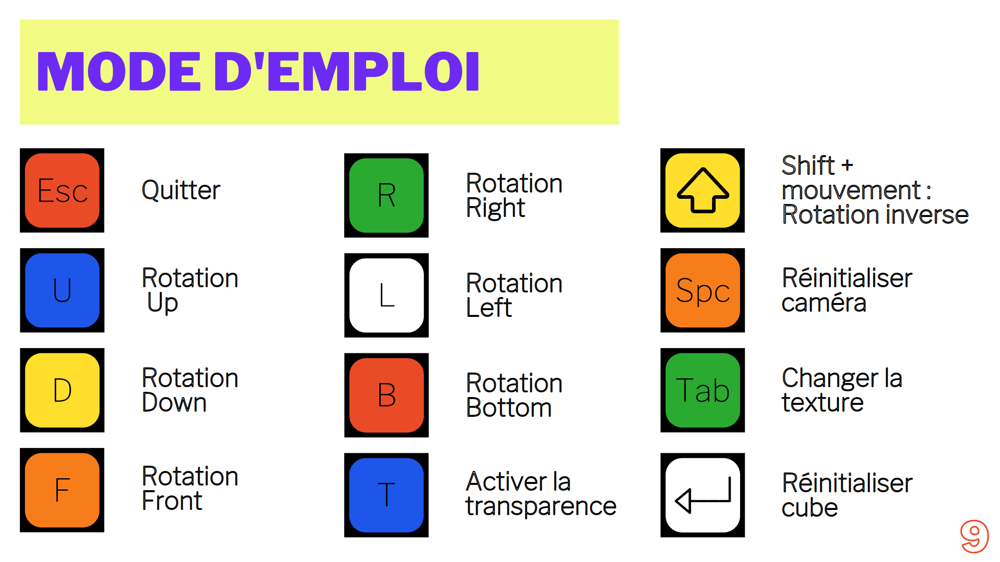

# rubiks-cube-opengl

Rubik's cube engin using OpenGL.

## Realizations

| | |
| ------ | ------|
|  |  |


## Usage

```
$ make
$ ./rubiks-cube-opengl
```
## Inputs




## Contributeurs

**Adrien ANTON LUDWIG**
**Adèle PLUQUET**
